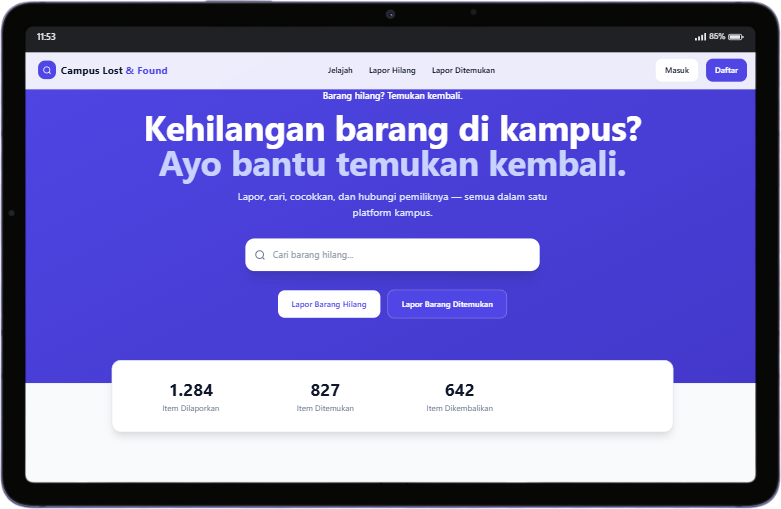

# Campus Lost & Found

Platform **SPA** untuk melapor, mencari, mencocokkan, dan mengklaim barang hilang & ditemukan di kampus. Backend Laravel (MySQL) + SPA Vue 3 + Tailwind.

## Tampilan



## Fitur

- **Auto-publish** — laporan langsung tampil untuk semua orang (moderasi admin tetap ada sebagai jalur lanjutan/penurunan, bukan penunda).
- Lapor barang hilang/ditemukan dengan foto + kategori + lokasi + jawaban verifikasi.
- Pencarian + filter: **mobile** pakai chip tipe/status + **bottom-sheet** (kategori/lokasi/urutan), desktop pakai filter 4 kolom + sort.
- **Possible match** otomatis (skor kategori/lokasi/waktu/teks, ambang 50) — notifikasi **dua arah**: pemilik & penemu (kecuali ke diri sendiri).
- Klaim barang → jawaban verifikasi divalidasi **di server** (jawaban benar tidak pernah dikirim ke klien) → admin approve/reject.
- Chat 1-lawan-1 (pemilik ↔ responden), polling, badge unread, lampiran nama item pada thread.
- Notifikasi: possible match, pesan baru, laporan baru, dsb — hapus item otomatis membersihkan notifikasi-nya.
- Dashboard user (statistik, laporanku, notifikasi terbaru, **sapaan dengan nama user**) & dashboard admin (grafik, moderasi, kelola user).
- Auth session + CSRF (session-based) untuk seluruh API; role admin/staff/student.

## Persyaratan

- PHP 8.4+ (`curl`, `openssl`, `mbstring`, `pdo_mysql`, `gd`, `fileinfo`, `intl`, `zip`)
- Composer 2+
- MySQL 8
- Node.js 18+ (untuk frontend)

## Setup

```bash
# 1. Backend dependencies + environment
composer install
cp .env.example .env
php artisan key:generate
php artisan storage:link

# 2. Database
# buat database MySQL bernama campus_lost_found, lalu:
php artisan migrate --seed

# 3. Frontend (build ke public/ agar tersaji sebagai SPA)
cd frontend
npm install
npm run build      # hasil (dist) disalin & di-rebuild ke public/assets + index.html
cd ..
```

Akun demo (dari seeder):

| Email | Password | Role |
|-------|----------|------|
| admin@campus.ac.id | `password` | admin |
| demo@campus.ac.id | `password` | student |

## Menjalankan (dev)

```bash
php artisan serve                # terminal 1 — backend http://localhost:8000
cd frontend && npm run dev       # terminal 2 — SPA http://localhost:5173 (proxy /api & /storage ke 8000)
```

## Produksi

1. `cd frontend && npm install && npm run build` (menghasilkan `dist/`, disalin ke `public/`)
2. `php artisan serve` di server; akses via HTTPS bila perlu
3. Pastikan `php artisan storage:link` jalan (foto diakses via `/storage/...`)

## Struktur

- `app/Http/Controllers/` — Auth, Item, Claim, Notification, Message, Dashboard, Admin
- `app/Services/` — `MatchingService` (possible match + notifikasi dua arah), `ApiResponse`
- `routes/api.php` — seluruh endpoint API (session + CSRF via middleware `web`)
- `frontend/` — SPA Vue 3 + Vite (sumber; build ke `public/`)
- `public/assets/` — hasil build SPA
- `database/migrations` + `database/seeders` — skema & data awal
